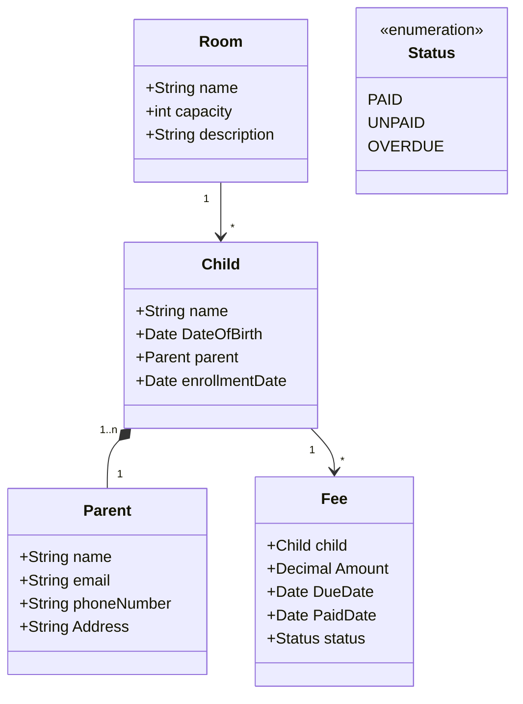

# Daycare Management System API

RESTful API de gestão de uma creche desenvolvida em Java 17 com Spring Boot 3, como parte do desafio de projeto da DIO.

## Principais Tecnologias Usadas
 - **Java 17**: Utilizaremos essa versão por estar de acordo com o desafio. De notar que actualmente existem versões mais avançadas;
 - **Spring Boot 3**: Trabalharemos com a 3 versão do Spring Boot;
 - **Spring Data JPA**: Exploraremos como essa ferramenta pode simplificar nossa camada de acesso aos dados, facilitando a integração com bancos de dados SQL;
 - **OpenAPI (Swagger)**: Vamos criar uma documentação de API eficaz e fácil de entender usando a OpenAPI (Swagger), perfeitamente alinhada com a alta produtividade que o Spring Boot oferece;
 - **Railway**: facilita o deploy e monitoramento de nossas soluções na nuvem, além de oferecer diversos bancos de dados como serviço e pipelines de CI/CD.

## Diagrama de classes (Domínio da API)

